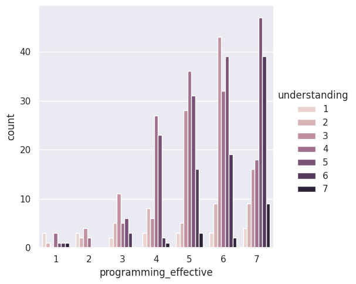
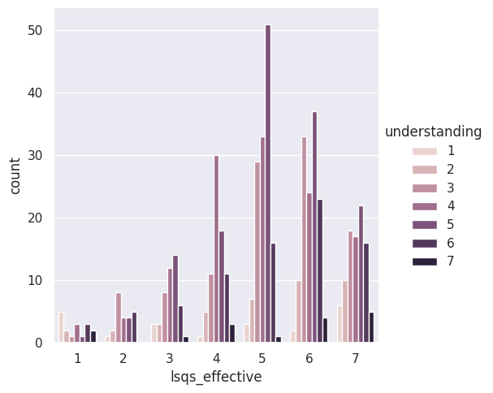
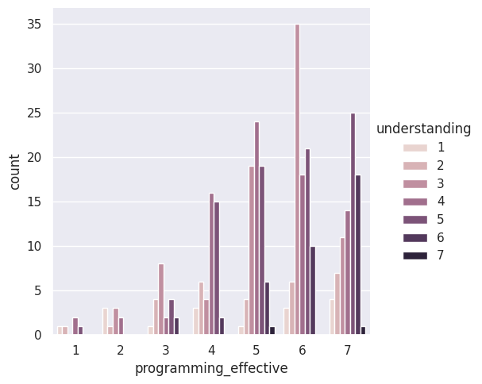
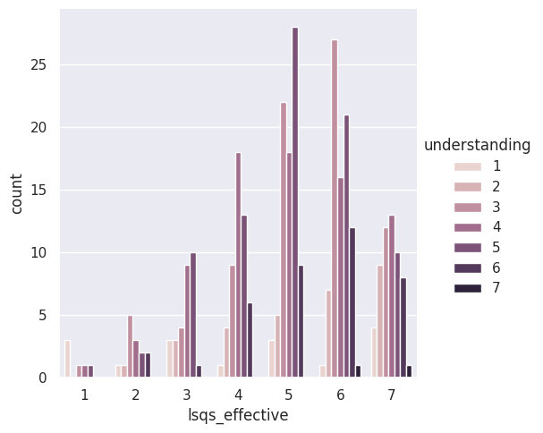

---
# Do not edit the text between these lines!
layout: default
---

# EX09 - Data Analysis for Continuous Improvement

<!-- This is a comment. Below, you'll see code for inserting an image. To make this image appear, update <custom-path>. To add an image, save it inside the imgs folder of this repository. -->

## Summary of Project

This final exercise explored how different types of practice problems impact a student's self reported understanding of course concepts. We wanted to determine if adding more code-writing and memory diagram practice to the course website would create significant value for students. We specifically looked the "effectiveness" of post-lesson questions and in-depth exercises on the "understanding" students felt they gained. The data come directly from current student surveys.

## Analysis

After cleaning and organizing the data from survey results, we found that "programming_effective" and "lsqs_effective" would be the most useful variables in our analysis. "programming_effective" refers how effective programming exercises are in helping student learn the topics of the course and "lsqs_effective" is the effectiveness of the post-lesson questions on gradescope. To see how these variables impact student learning, we chose to analyze the "understanding" responses with these variable. For "understanding", students rank if they feel more lost or understand everything on a scale from 1 to 7.

The catplots below provide a clear visual of the relationship between practice and understanding.

             

As the "programming_effective" rank increased, the "understanding" scores shifted upward significantly. Most students who rated assignment effectiveness at a 7 reported understanding scores between 5 and 7. This suggests a positive relationship between coding practice and student confidence.

The results for the post-lesson questions were much flatter and less conclusive. The distribution of understanding scores were scattered across the middle range regardless of how effective students found the activity. This indicates that while LSQs are a decent review tool, they are not as effective as the active problem-solving found in programming assignments.

To dive deeper into the analysis, we created a custom helper function, filter_experience, to isolate the students with no prior coding background. We predicted that experienced students might skew the data with high understanding scores and lower perceived effectiveness of assignments. For new coders, there was still a positive relationship between programming exercises and understanding. Additionally, there was a stronger relationship with the programming exercises than the post-lession questions. This comparison reinforces the idea that for students starting with no prior experience, challenging and in-depth practice like code writing is more valuable than quick conceptual checks.

             

## Conclusions and Recommendations

Our analysis supports the idea that practice problems, and the specific types of practice, are an important driver of student understanding. By comparing the relationship between "programming_effective" and "understanding", we found a positive correlation where students who find the assignments effective consistently report higher confidence levels. However, the analysis of "lsqs_effective" showed a weaker relationship, suggesting that these quick post-lesson questions are less impactful on a student's overall understanding of the material than in-depth and challenging programming activities.

We recommend that the course provide additional, optional code-writing exercises and memory diagram practice on the course website. Even after filtering for student with no prior coding experience, those who said the assigiments were effective reported higher confidence levels. Since the current assignments are already viewed as effective, giving students more of these high-impact activities will help to improve overall student performance. 

To refine this idea, we believe that tracking student performances on actual exams will help to validate this idea. There may be a disconnect between self-reported "understanding" and the numerical grade students earn on quizzes. While tests are not the perfect indicator of mastery, looking at exams along with the survey results would further strengthen this analysis. Additionally, testing different types of programming exercises and getting student feedback on what was helpful will help to find the most effective types of practice. 

The main cost of this change is student and instructor time. While our idea proposes optional practice, students eager to support their learning and success in the course will likely have to dedicate even more time to this class by doing the problems. The practice problems may increase the workload and stress a student faces, potentially causing burnout. However, the largest impact will be on instructors, who not only have to find or create these practice questions, but also post answers and be available for any questions students may have related to these additional problems. On top of the grading, holding office hours, and managing busy schedules, the instructional team may face increased burden with these new materials. 
